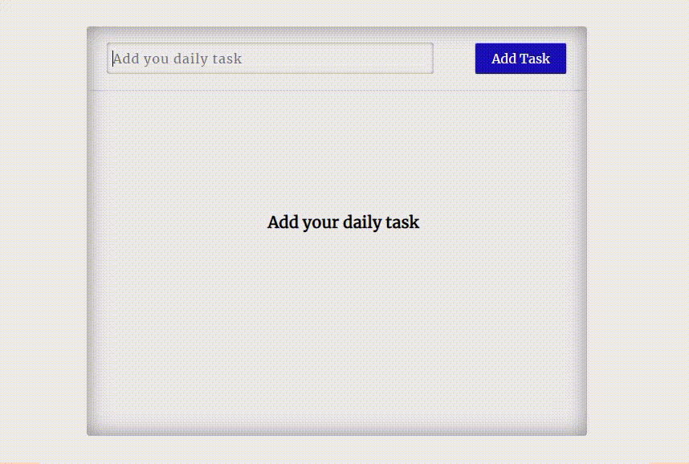
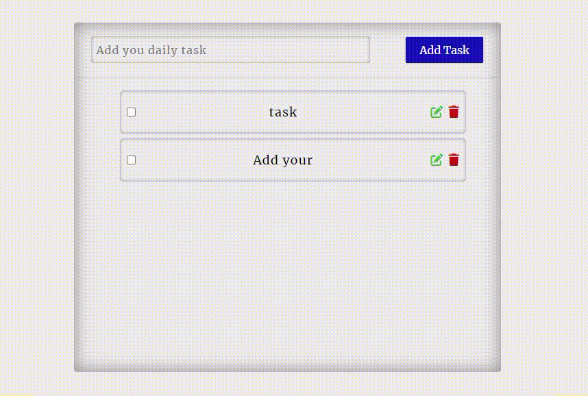
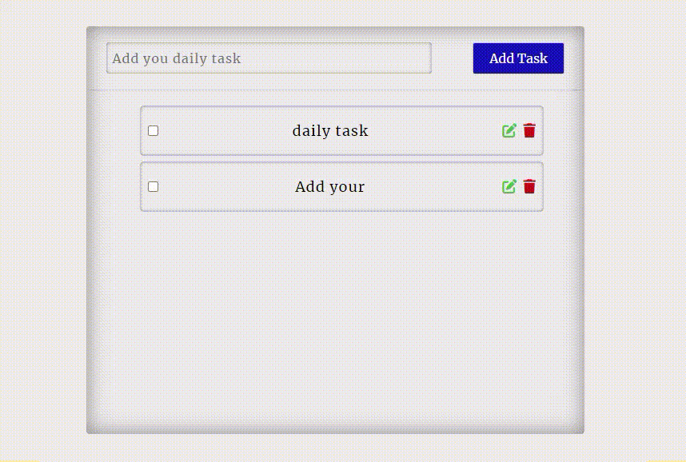
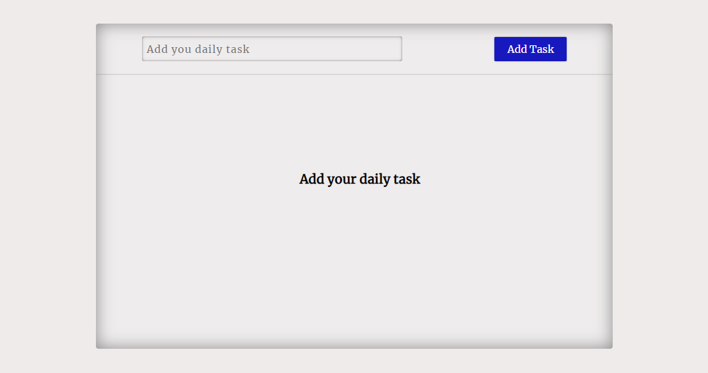

<h1 align="center">Todo App</h1>

<h3>Create a to-do list as simple or detailed as you need</h3>

<h3>Technologies Used</h3>

 
 

<h3>Features and Description</h3>

The Todo-App's features include:

[Add your daily task](https://nidhisharma63.github.io/react-todo-app/)

<h4>Adding Tasks</h4>

<h4>Editing Tasks</h4>

<h4>Deleting the task</h4>
  

<h4>User Friendly UI</h4>
 

